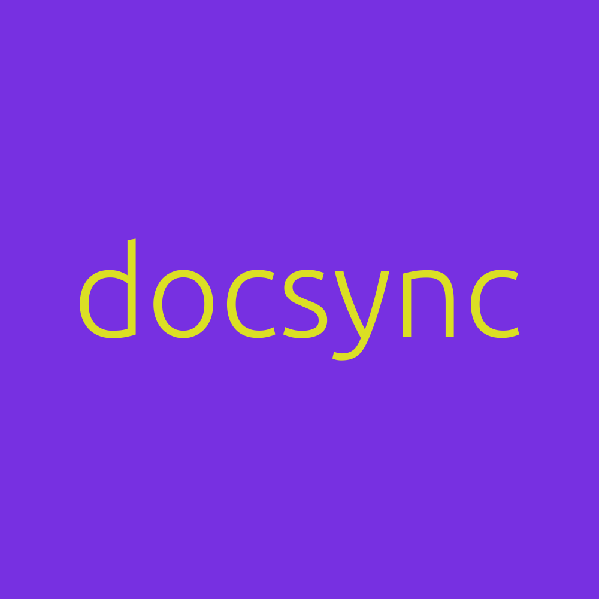

<p align="center">
  
</p>

docsync is a pre-commit hook and CLI tool that deterministically flags when code changes should trigger documentation updates. It outputs agent-friendly JSON with targeted information about what changed and which doc sections need review.

When working fast with tools like Claude, docs drift quickly. Agents excel at changing code but struggle to understand how code changes should trigger doc updates. docsync addresses this with deterministic checks.

## Three Core Use Cases

**1. Track Doc Sync** - Block commits when linked documentation becomes stale. Define code→doc relationships, docsync uses git diff to detect when docs need updates.

**2. Flag Protected Content Changes** - Prevent accidental changes to licenses, brand assets, and policies. Protected sections are never marked stale, protected literals trigger warnings.

**3. Audit for Deterministic Maintainability** - Score documentation structure for trackability using the audit skill in Claude Code. Get concrete suggestions for improvements.

**📚 [Full docs](https://nlebovits.github.io/docsync/)** | **[Getting Started](https://nlebovits.github.io/docsync/getting-started/)** | **[CLI Reference](https://nlebovits.github.io/docsync/cli/reference/)**

## Quick Start

```bash
# Install
uv pip install git+https://github.com/nlebovits/docsync.git

# Initialize
docsync init

# Audit docs for trackability (in Claude Code)
> Audit my documentation and apply the suggestions

# Auto-generate convention-based links
docsync bootstrap --apply

# Validate and check coverage
docsync validate-links
docsync coverage

# Enable pre-commit enforcement
docsync install-hook

# Now commits block if docs are stale
git commit -m "refactor auth"
# ❌ Blocked: docs/api.md#Authentication unchanged since src/auth.py changed
```

## License

Apache-2.0

## Contributing

[Contributing Guide](https://nlebovits.github.io/docsync/contributing/)
